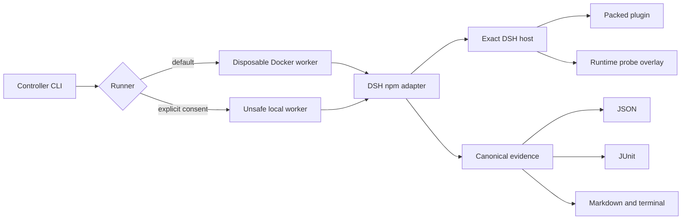

# Architecture

DSH Testkit keeps control, transport, and untrusted execution separate.

The controller validates the scenario, chooses a runner, and renders projections. It never imports plugin code. The worker owns a fresh DSH home, profile, workspace, package area, logs, and observer snapshots. Local directories are copied and packed before DSH installs the tarball. A Testkit-owned no-op bundle creates and removes the empty profile baseline first, so install-time and boot-time filesystem residue can be separated from DSH's own profile scaffolding.

The DSH adapter is the only version-sensitive layer. It invokes the real profile and plugin CLI, appends a Testkit-owned Cordis probe through `--patch`, and stops the host only after the probe writes its atomic result. The probe enumerates requested services and tool schemas and can call explicitly declared tools without a model.

Docker is the security boundary for the default workflow. The worker runs as the caller's numeric user with a read-only root filesystem, an init process, all Linux capabilities dropped, `no-new-privileges`, CPU, memory and process limits, disposable `/work` and `/tmp`, and read-only source mounts. This is still not a claim that arbitrary code is harmless. The local runner executes package and plugin code on the host and requires `--unsafe-local`.

Observer results are capability-aware. Files under the owned root, process checkpoints, port checkpoints, and canary log scans disclose their limitations in every report. Network tracing is unavailable in v0.1, so a scenario that requires it receives `unsupported`, never a synthetic pass.

Command output is sanitized before persistence and bounded to 8 MiB per stream. Exceeding that limit fails the owning stage instead of silently claiming complete evidence.
