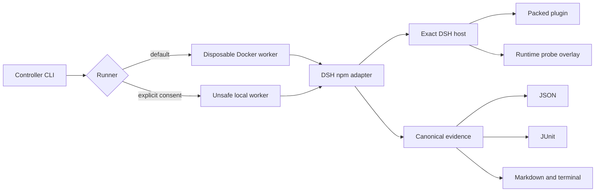

# Architecture

DSH Testkit keeps control, transport, and untrusted execution separate.

The controller validates the scenario, chooses a runner, and renders projections. It never imports plugin code. The worker owns a fresh DSH home, profile, workspace, package area, logs, and observer snapshots. Local directories remain read-only inputs: the worker copies them into its owned root, restores development dependencies when a pack lifecycle script requires them, and then runs `npm pack`. The declared `packageManager` and lockfile select the install command, while Corepack state lives in a writable run directory seeded from the immutable image. DSH only installs the resulting tarball. A Testkit-owned no-op bundle creates and removes the empty profile baseline first. The subject-free profile then boots to a runtime probe before the install and boot snapshots are taken. Host-created files are baseline state, while subject changes to those same paths remain attributable by content. Baseline boot failure is infrastructure failure, not a plugin verdict.

Browser smoke uses the host Connection service's `authenticatedUrl` API when present. The versioned probe hands that URL to the adapter through a mode-0600 file inside the disposable work root, not through public probe evidence. The adapter validates the exact owned loopback authority and root token-exchange path, deletes the private handoff, and uses a fresh browser context. Launch-token query values are redacted from command logs, including crashes before the probe. Reports contain neither the launch URL nor cookies, and screenshots are captured only after the exchange redirects to a token-free URL. Hosts without the authentication API retain direct navigation.

The DSH adapter is the only version-sensitive layer. It invokes the real profile and plugin CLI, appends a Testkit-owned Cordis probe through `--patch`, and stops the host only after the probe writes its atomic result. The probe enumerates requested services and tool schemas and can call explicitly declared tools without a model.

Docker is the security boundary for the default workflow. The worker runs as the caller's numeric user with a read-only root filesystem, an init process, all Linux capabilities dropped, `no-new-privileges`, CPU, memory and process limits, disposable `/work` and `/tmp`, and read-only source mounts. This is still not a claim that arbitrary code is harmless. The local runner executes package and plugin code on the host and requires `--unsafe-local`.

Observer results are capability-aware. Files under the owned root, process checkpoints, port checkpoints, and canary log scans disclose their limitations in every report. Network tracing is unavailable in v0.1, so a scenario that requires it receives `unsupported`, never a synthetic pass.

Command output is sanitized before persistence and bounded to 8 MiB per stream. Exceeding that limit fails the owning stage instead of silently claiming complete evidence.

The Composite Action keeps reporting and repository mutation separate. Its default `publish-junit-check: 'false'` mode emits annotations and uploads evidence with `contents: read`. Only a trusted workflow that explicitly opts into a named JUnit Check needs `checks: write`.

All source CI artifact outlets share `scripts/prepare-evidence.mjs`. After execution, it checks a bounded allowlist of diagnostic files, refuses linked or private host content and recognizable credentials, then writes a fresh private staging directory with a hash manifest. Upload and JUnit actions consume only that staged directory when the check succeeds. A rejected bundle is not partially published or silently redacted; the check reports only its rejection category. This publication boundary complements runtime redaction but cannot certify arbitrary text or screenshot pixels as public-safe.
